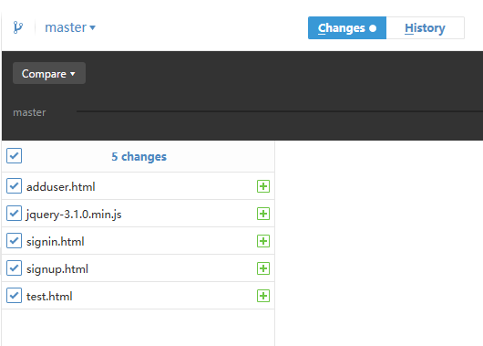

# 使用 git 和 GitHub 上传项目
这里主要介绍 git 命令行和 GitHub 客户端结合使用，互补优缺点

GitHub 客户端：可以图形化所有文件修改、文件融合合并和分支的创建，也可以提交修改、执行分支创建合并，但缺点是提交、合并速度慢，提交融合 pull request 还需到官网合并，优点是所有东西可以图形化，特别是修改过的文件都有提示和记录

git 命令行：优点提交、合并速度快且可以很容易的找到一些错误问题，命令行提示很全面，缺点是没有图形化所修改过的文件

1、整体流程
> a. 在 GitHub 网站上创建 ooo 项目

> b. 进入相关文件夹，初始化项目

```
cd ../test
echo "# ooo" >> README.md
git init
git add README.md
git commit -m "first commit"
git remote add origin https://github.com/Harveytwo/ooo.git
git push -u origin master
```
**这里如果使用 GitHub 的客户端，直接 Add 本地的 ../test 项目即可
> c. 上一步只是在 GitHub 上初始化了 ooo 项目和增加了个 README.md 文件，此时还需上传本地修改的文件，使用客户端就可看到


添加文件
git add -A

> d. 提交修改文件
git commit -a
**注意，如需忽略上传某目录，需新建个 .gitignore 文件并加上如如下代码（此处是以忽略 node_modules 目录）：
```
.DS_Store
node_modules/
```
> e. 提交远程服务器
git push

2、多个分支工作
> a. git checkout -b test     //创建并切换到 test 分支

> b. git支持很多种工作流程，我们采用的一般是这样，远程创建一个主分支，本地每人创建功能分支，日常工作流程如下：

```
去自己的工作分支
$ git checkout test

工作
....

提交工作分支的修改
git commit -a
git push

回到主分支
git checkout master

获取远程最新的修改，此时不会产生冲突
git pull

回到工作分支
git checkout test

用rebase合并主干的修改，如果有冲突在此时解决
git rebase master

回到主分支
git checkout master

合并工作分支的修改，此时不会产生冲突。
git merge test --squash
用 squash 参数 
这个参数是合并时把你 test 分支上做的提交合并成一个，此时 merge 不会做提交，需要你重新做一次提交

//另一种合并参数
对Develop分支进行合并
git merge --no-ff develop
命令的--no-ff参数是什么意思。默认情况下，Git执行"快进式合并"（fast-farward merge），会直接将Master分支指向Develop分支。


提交到远程主干
git commit -a    //在最上面写入修改的描述
git push
```

这样做的好处是，远程主干上的历史永远是线性的。每个人在本地分支解决冲突，不会在主干上产生冲突。

**解决冲突
Auto Merge Failed; Fix Conflicts and Then Commit the Result.
我一般使用
方法二：我们不能丢弃本地修改，因为其中的某些内容的确是我们需要的，此时需要对 unmerged 的文件进行手动修改，删掉其中冲突的部分，然后运行如下命令
git add filename
git commit -m "message"

**好了，至此就完结了。以下是一些零碎笔记，需要就看，不需要忽略哈...
**如需要了解更多 git 知识，可以参考，很简洁且清除地介绍了 git 哦：http://www.ruanyifeng.com/blog/2012/07/git.html
**偶尔使用 git status 查看当前状态，会有意想不到的收获，特别是不造出现什么错误的时候


## 使用 git clone GitHub 上的项目
> 1、git clone git 地址

> 2、克隆到本地，然后使用桌面应用工具

> 3、点击 Add 把刚克隆的文件，添加 Add repository, 就可以在桌面工具看到项目的详细信息了哦


## 使用 git tag 标签相关操作

标签可以针对某一时间点的版本做标记，常用于版本发布。
发布的时候： git tag -a 1.0   填写相关版本信息

```
// 打标签
git tag -a 1.0

git checkout [tagname]  // 切换到标签  tagname 即是 版本号 1.0  
git tag // 在控制台打印出当前仓库的所有标签
git show 1.0  //  查看标签的版本信息

// 删除标签
git tag -d v0.1.2 # 删除标签  // 注意提交后的 tag 不能删除了

// 标签发布
// 通常的git push不会将标签对象提交到git服务器，我们需要进行显式的操作
git push origin 1.1     // 将 1.1 标签提交到 git 服务器
git push origin –tags  // 将本地所有标签一次性提交到 git 服务器
```

<br />
<br />
=================================== End ====================================


<br />
<br />
<br />
<br />
<br />
<br />
<br />

# 以下是零碎笔记：

> 1、在 GitHub 网站上创建 nodeDBTest2 项目
git init

> 2、git remote add origin https://github.com/lilian132/nodeDBTest2.git  //添加一个远程服务器
git push -u origin master   //push至服务器，首次push加上-u
已经把 .gitattributes 和 .gitignore 文件上传

> 3、git commit -m "first commit"   //填写修改描述，再提交所修改的文件

> 4、git push origin master    //上传所修改项目到远程服务器

在 GitHub 网站上创建 mygit 项目
cd nodeDBTest3
echo "# mygit" >> README.md
git init
git add README.md
git commit -m "first commit"
git remote add origin https://github.com/Harveytwo/mygit.git
git push -u origin master

一般上传遇到问题，会有英文提示，拿去百度，会有解决方法的

git commit -a   //提交命令，需在记事本上写上描述

git branch <new-branch-name>    //创建分支

git merge test --squash
用 squash 参数 
这个参数是合并时把你 test 分支上做的提交合并成一个，此时 merge 不会做提交，需要你重新做一次提交

解决冲突啊：
Auto Merge Failed; Fix Conflicts and Then Commit the Result.
方法一：如果我们确定远程的分支正好是我们需要的，而本地的分支上的修改比较陈旧或者不正确，那么可以直接丢弃本地分支内容，运行如下命令(看需要决定是否需要运行git fetch取得远程分支)：

$:git reset --hard origin/master
或者$:git reset --hard ORIG_HEAD

解释：
git-reset - Reset current HEAD to the specified state


--hard
   Resets the index and working tree. Any changes to tracked files in the working tree since <commit> are discarded.

方法二：我们不能丢弃本地修改，因为其中的某些内容的确是我们需要的，此时需要对unmerged的文件进行手动修改，删掉其中冲突的部分，然后运行如下命令

$:git add filename

$:git commit -m "message"

方法三：如果我们觉得合并以后的文件内容比价混乱，想要废弃这次合并，回到合并之前的状态，那么可以运行如下命令：

$:git reset --hard HEAD


**合并流程
去自己的工作分支
$ git checkout work

工作
....

提交工作分支的修改
$ git commit -a
$ git push

回到主分支
$ git checkout master

获取远程最新的修改，此时不会产生冲突
$ git pull

回到工作分支
$ git checkout work

用rebase合并主干的修改，如果有冲突在此时解决
$ git rebase master

回到主分支
$ git checkout master

合并工作分支的修改，此时不会产生冲突。
$ git merge work --squash

提交到远程主干
$ git commit -a    //在最上面写入修改的描述
$ git push
